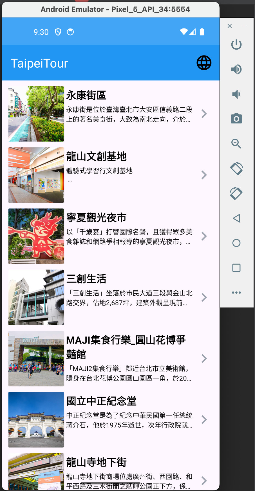
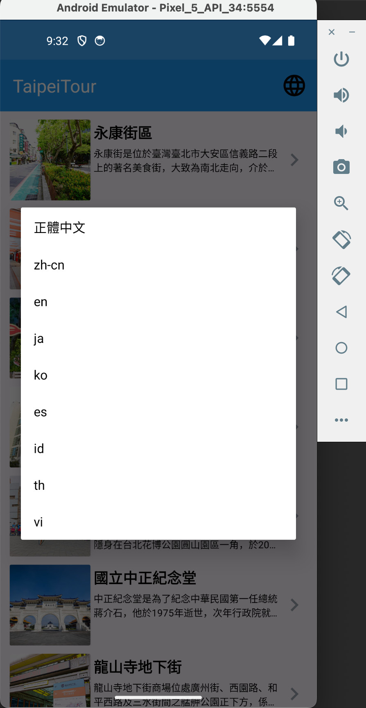
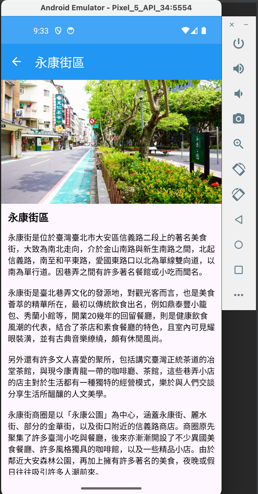
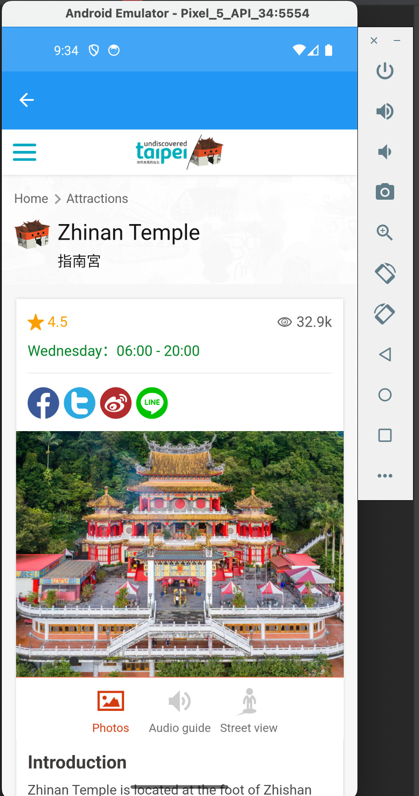

# TPI Assignment

This project showcases tourist attractions in Taipei and includes language switching functionality, photo display, and WebView integration.

## Features

- Attractions List: displays a list of tourist attractions retrieved from API.
- Language Switching: Users can switch the app's language, ensuring that the title and relevant content are displayed in the selected language.
- Attraction Details: shows detailed information about a selected attraction, including photos, tourist address, last updated time and a link to the official website displayed in a WebView.
- Webview: shows the tourist web url.

## Screenshots

   

## Demo

Demo apk: [apk](https://drive.google.com/file/d/1Q1C0Q7elITtSGfW4YV6LjCgfPs6OS87B/view?usp=sharing)

## Installation

To run this project, follow these steps:

1. Clone the repository:

```bash
git clone https://github.com/anhoang241998/TPIAssignment.git
```

2. Open the project in Android Studio.
3. Build and run the project on an Android device or emulator.  

## Architecture

This project follows the MVVM (Model-View-ViewModel) architecture pattern:

- Model: Handles data operations, including network requests to the Taipei Tourism API.
- View: Consists of Fragments that display the UI components.
- ViewModel: Manages the UI-related data in a lifecycle-aware way and handles the communication between the Model and the View.

## Technologies and Libraries Used

### Core Libraries

- **Kotlin**: Primary programming language.
- **AndroidX Core KTX**: Provides Kotlin extensions for common Android framework APIs.

### UI Components

- **Fragments**: For creating screen components.
- **AppCompat**: For backward compatibility of Android features.
- **Material Design**: For implementing modern UI components.
- **ConstraintLayout**: For designing complex layouts.
- **SwipeRefreshLayout**: For implementing pull-to-refresh functionality.
- **SkeletonLoading**: For displaying skeleton loading screens.

### Navigation

- **Jetpack Navigation**: For managing navigation and handling navigation events.
- **Safe Args**: For type-safe argument passing in navigation.

### Networking

- **Retrofit2**: For making HTTP requests to the tourist API.
- **Gson Converter**: For converting JSON responses into Kotlin data objects.

### Dependency Injection

- **Koin**: For dependency injection.

### Coroutines

- **Kotlin Coroutines Core**: For handle effective background processing.
- **Kotlin Coroutines Android**: For using coroutines with Android components.

### Image Loading

- **Coil**: A loading images library in a lightweight manner.

### Logging

- **Timber**: For logging in Android.
- **Logger**: For structured and leveled logging.

### Miscellaneous

- **Desugar JDK Libraries**: For using newer Java language features on older Android versions.

## Contact

If you have any questions or feedback, please contact me at an2419998@gmail.com.
